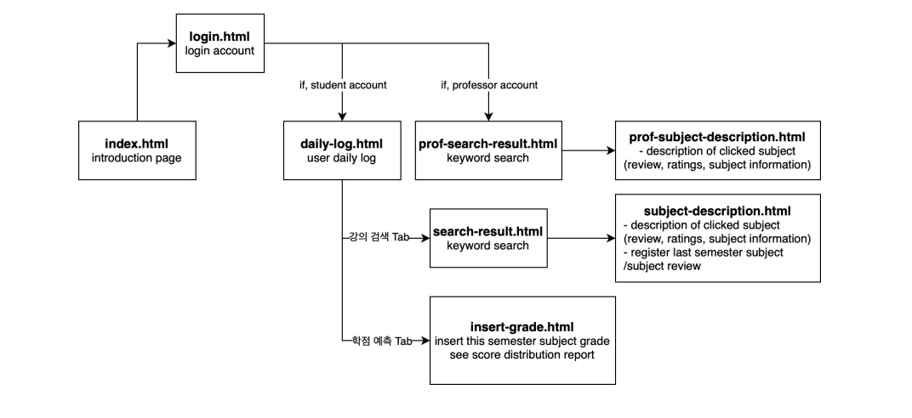
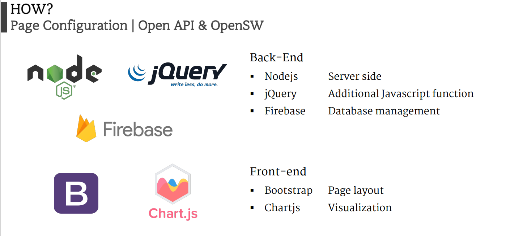
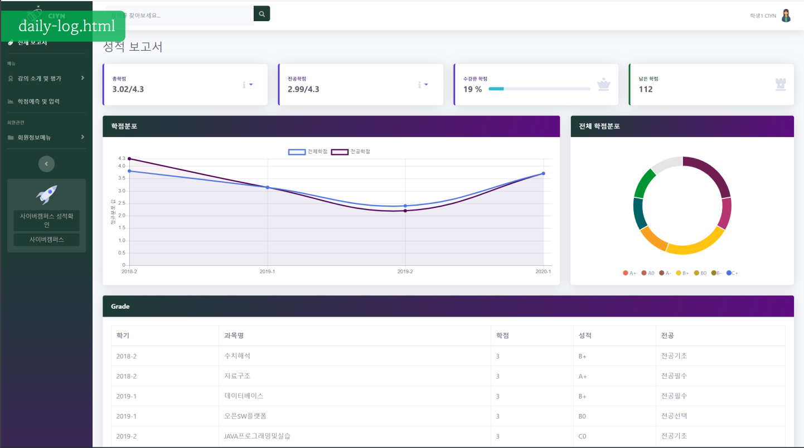
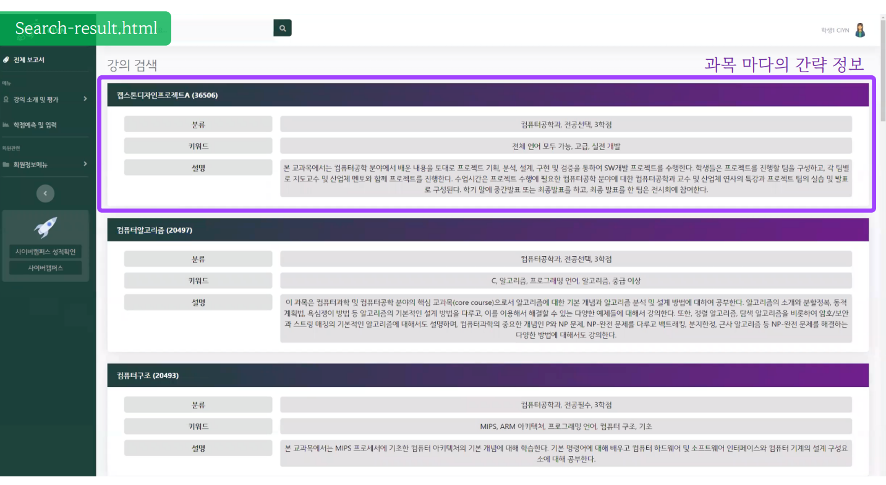
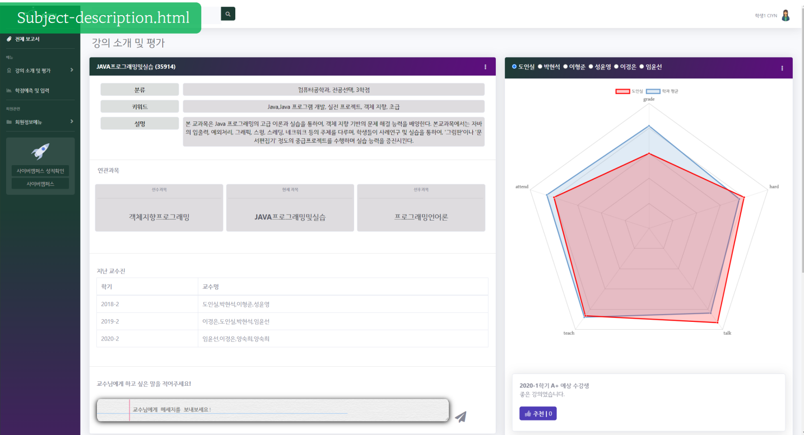

  <h3 align="center">CIYN | Course Information You Need</h3>
  

    Open Software Platform · Fall 2020
  

  <a href="https://github.com/JiyooonPark/CIYN" align="center">:link: GITHUB</a>

<!-- ABOUT THE PROJECT -->
## About The Project

Implementing an AR application step by step using planar homographies. Finding point correspondences between two images and use these
to estimate the homography between them. Then using this homography to warp images and finally implement it on AR applications.

## Page Configuration

- front-end-bootstrap folder has all elements of our site.
- front-end-prototype folder has the prototype images of our site.  

## Implementation Tools & Prerequisites

 
We used Firebase, Nodejs, jQuery for back-end, Bootstrap, Chartjs for front-end and visualization. 
- Back-end
  * Nodejs | Server side, get SESSION information
  * jQuery | to deal with Additional Javascript Functions
  * Firebase | use Database easily
- Front-end
  * Bootstrap | For page layout
  * Chartjs | to visualize several results
  
## Demo


 

### Collaborators
한지수 Jisu Han([@JisuHann](https://github.com/JisuHann)) - 1871056

김민영 Minyoung Kim([@kkminyoung](https://github.com/kkminyoung)) - 1829008

박지윤 Jiyoon Park ([@jypark](https://github.com/jiyoonpark0207)) - 1876166

조하연 Hayeon Jo ([@hayeon99](https://github.com/hayeon99)) - 1976377

### LICENSE
This project follows MIT LICENSE. Click [here](https://github.com/JisuHann/CIYN/blob/main/LICENSE) to see more details.