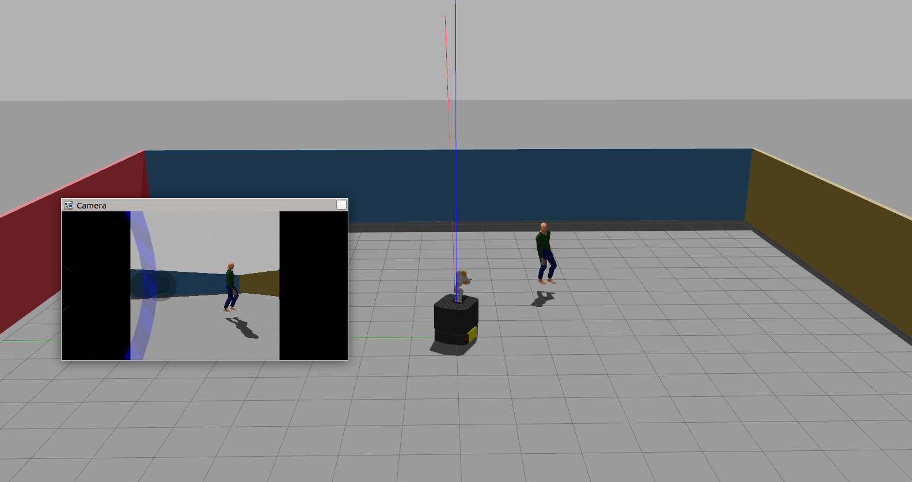
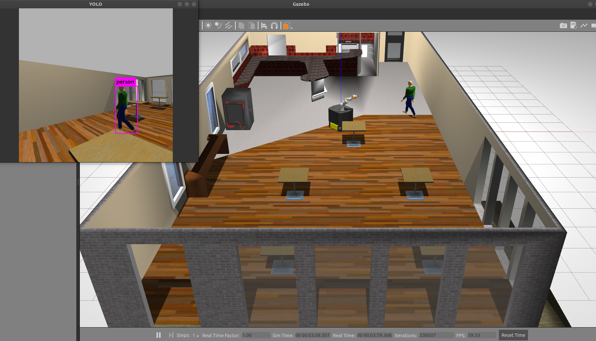

  <a href="https://github.com/JiyooonPark/Camera-Mobile-Manipulator">:link:GITHUB</a>

## Quick Start

    roslaunch cmm_gazebo ridgeback_iiwa_gazebo.launch 
    roslaunch cmm_viz mobile_manipulation_interactive_demo.launch
    roslaunch darknet_ros darknet_ros.launch 

## Visual Servoing Test in real world 

## Manipulation Replication Test in real world 

## Default World 

## Darknet 

## Camera Movement in Simulation 

## LINKS 

Visual Servoing:

    https://github.com/savnani5/Visual-Servoing/

Object Detection cpp:

    https://docs.openvino.ai/latest/omz_demos_object_detection_demo_cpp.html

RGBD Camera:

    https://www.stereolabs.com/docs/ros/depth-sensing/

Gazebo person 

    - walking robot: http://gazebosim.org/tutorials?tut=actor&cat=build_robot

## TODO
- add RGBD camera instead of rgb camera
- move custom darknet to cmm_darknet
- make ridgebcak follow person 
- 

## Launch
    roslaunch cmm_gazebo ridgeback_iiwa_gazebo.launch 
    roslaunch cmm_viz mobile_manipulation_interactive_demo.launch 
    roslaunch darknet_ros darknet_ros.launch 
    rosrun cmm_darknet bounding_box_subscriber.py 

    roslaunch realsense2_camera rs_camera.launch