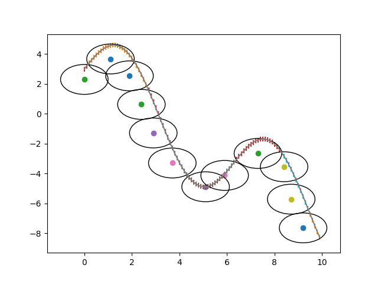

<div align="center">
  <a href="http://graphics.ewha.ac.kr/TSPArt/" align="center">:link:PROJECT PAGE</a>
  &nbsp;&nbsp;
  <a href="https://github.com/JiyooonPark/ridgeback_trajectory_planning" align="center">:link:GITHUB</a>
</div>

### Motivation:
In taking our project to the next level, we wanted to allow our robot to draw on a large curved surface. This repository is for calculating the trajectory for following the curved wall. 


---

### Input:
Mesh wall in .obj file form 


### Output:
ridgeback trajectory

something like this:
```angular2html
X:-1.65, -0.86, -0.09, 1.64, 2.52, 3.6, 5.25, 5.27, 6.71, 7.09, 7.87, 9.79, 9.86
Y: -4.0, -4.34, -4.4, -4.31, -4.52, -4.04, -3.64, -3.65, -4.69, -4.63, -4.34, -4.73, -4.84
```


---


### Problems:
The repository is still going under constant modifications :smile:
If you have any suggestions, your help will be greatly appreciated :smile:


---


### How To Use:
I warned you that it still need more work... but if you are willing to wait...:turtle:
```commandline

1. Place your .obj file in /input
2. Open trajectory_planning_v10.py
3. Change the file_name to your file 
4. Hit run and WAIT
5. Look at terminal for progress, result

```


*** Progress Stages***

**2021.08.09**

Started by covering simple wall with squares 


**2021.08.10**

Started by covering complex wall with squares 


**2021.08.11**

Started by covering wall with circles 


**2021.08.21**

Started by covering wall with small circles for better trajectory


**2021.09.10**

Update minor changes


**2021.09.11**

Realized that I have not considered the actual robots -> fixed the problem but now it is super slow :sad:


**2021.09.26**

Started considering iiwa and wall collision


**2021.09.30**

Due to the deadline moving up, needed a trajectory that ensures least movements. 

Trajectory that puts ridgeback side to side (v8). 


**2021.10.09**

Updated configurations to match gazebo world + cleaned up algorithm to have better efficiency
