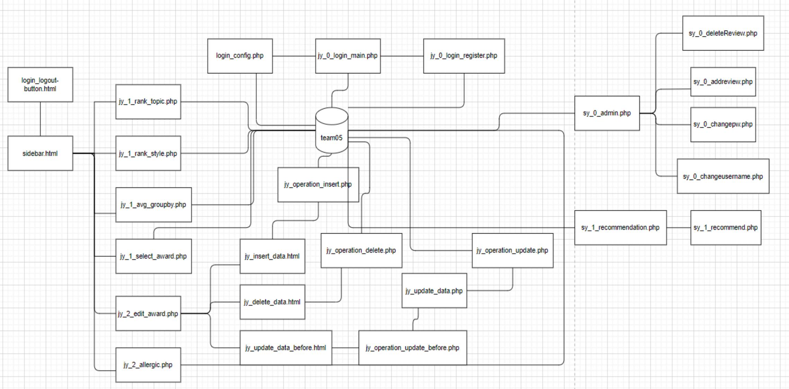
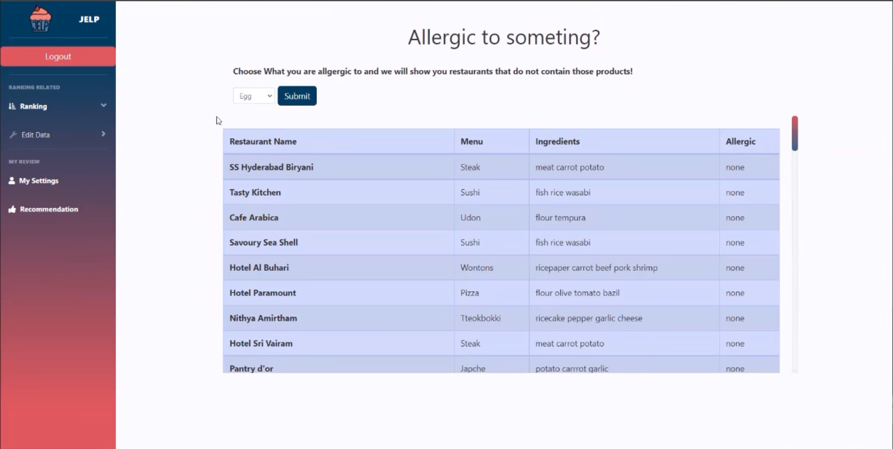
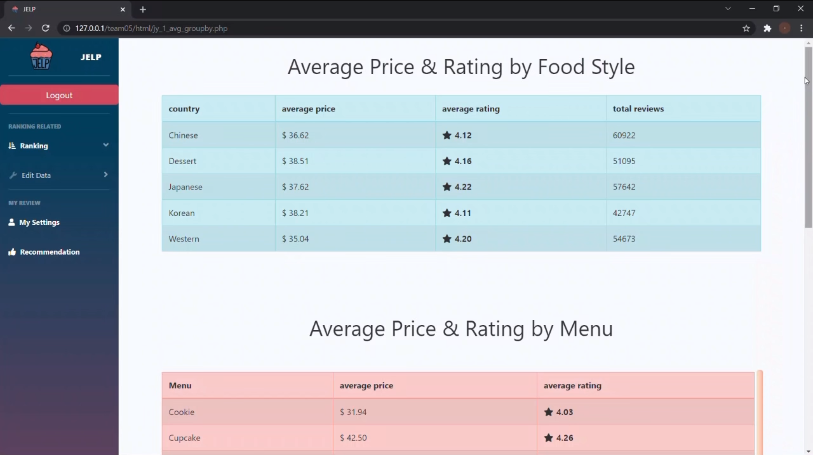

<!--https://github.com/othneildrew/Best-README-Template-->

  <h3 align="center">JELP: Restaurant Recommendation and Analysis Website</h3>
  

    Big Data Application · Fall 2021
  

  <a href="https://github.com/JiyooonPark/BigDataApplicationProject" align="center">:link:GITHUB</a>

<!-- ABOUT THE PROJECT -->
## About The Project

Our Project JELP is a restaurant recommendation
service that also provides useful information on
restaurants. Our website cannot be accessed unless a
user logs into the website. Once logged in, the user has
access to all rank viewing, selecting, and viewing
wanted data and data manipulation!

### Built With: 
* PHP
* SQLite
* HTML/CSS/JS
* Bootstrap
* Python

## Database Schema & ER diagram 

## Overview of PHP Code Structure

<!-- Results  -->
## Demonstraion of website 

_

(<a href="#readme-top">back to top</a>)
